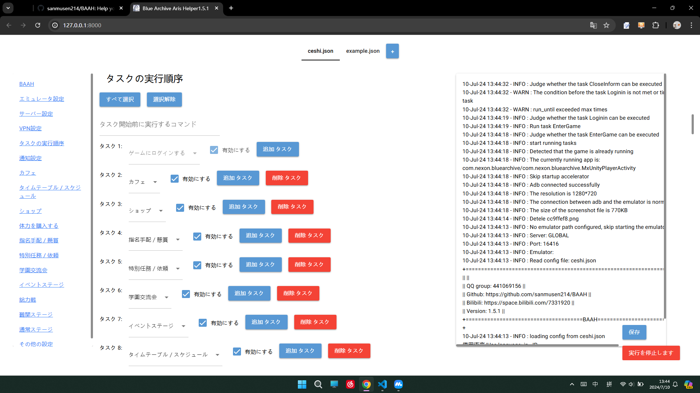

# 碧蓝档案爱丽丝助手 (BAAH)

---

BAAH可以帮助你在模拟器内自动完成碧蓝档案（国际服，日服，国服）的每日任务

BAAH can help you finish daily tasks of BlueArchive (Global server, Japan server, CN server) in emulator automatically.

---

[项目文档 | Project Document](./README.md) <-- You are here | 你在这里

[中文使用文档](./docs/README_cn.md) | [English Usage Document](./docs/README_en.md)

[中文开发文档](./docs/README_dev.md) | [English Dev Document](./docs/README_dev_en.md)

---

# Support

支持的操作系统/Systems supported:

- Windows (executable file, source code)
- MacOS (source code)
- Linux (source code, docker)

支持的BA游戏服务器/Supported BA servers：

- 国际服 Global Server 
- 日服 Japanese Server 
- 国服 CN Server 
- B服 CN Bilibili Server 

# Functions

支持的功能:

- 自动打开模拟器，自动执行，自定义添加启动加速器任务，自动关闭模拟器
- 领取（咖啡馆产出/邀请/摸头，社团签到，每日任务奖励，邮件，活动，战术大赛，总力战）
- 消耗体力/票卷进行扫荡（课程表，普通关，困难关，活动关，悬赏通缉，特殊任务，学院交流会，战术大赛，总力战）
- 购买（每日商店购买，竞技场商店购买）
- 探索（清桃信红点，推普通关卡，推困难关卡，推活动关卡，推主线剧情）

Supported Functions：

- Auto open emulator
- Collect (Cafe Rewards, Invite in Cafe, Touch Head, Club Sign in, Daily Task Rewards, MailBox，Event Rewards，Tactical Challenge Rewards, Total Assault Rewards)
- Spend tickets/power to raid (Timetable, Normal, Hard, Event, Bounty, Commissions, Scrimmage, Tactical Challenge, Total Assault)
- Buy (Normal Shop，Tactical Challenge Shop)
- Explore (Momotalk, Normal, Hard, Event, Episode)

# Star

如果觉得本项目对你有帮助，请点一点网页右上角的Star⭐ / Please star⭐ if you like it, ^ ^.

# Usage

如何使用请见使用文档 / Get to know how to use BAAH by reading usage documents

[中文使用文档](./docs/README_cn.md) | [English Usage Document](./docs/README_en.md)

# Thank

Icons from [@dada008](https://space.bilibili.com/23726244)

Japanese server support from [@LLL1997](https://github.com/LLL1997)

CN server support from [@子墨](https://space.bilibili.com/11179370)

Fully English logging support and function enhancement from [@ly5519](https://github.com/ly5519)

Linux platform suitable by [@lonzzi](https://github.com/lonzzi)

Besides, many of them have joined the continues development of BAAH, thanks.

Packages used in this project:

[opencv-python](https://github.com/opencv/opencv)

[pponnxcr](https://github.com/hgjazhgj/pponnxcr)

[nicegui](https://github.com/zauberzeug/nicegui)

# Other：

Other scripts about BlueArchive

1. [BAAuto](https://github.com/RedDeadDepresso/BAAuto)
2. [MBA](https://github.com/MaaAssistantArknights/MBA)
3. [BAAS](https://github.com/pur1fying/blue_archive_auto_script)
